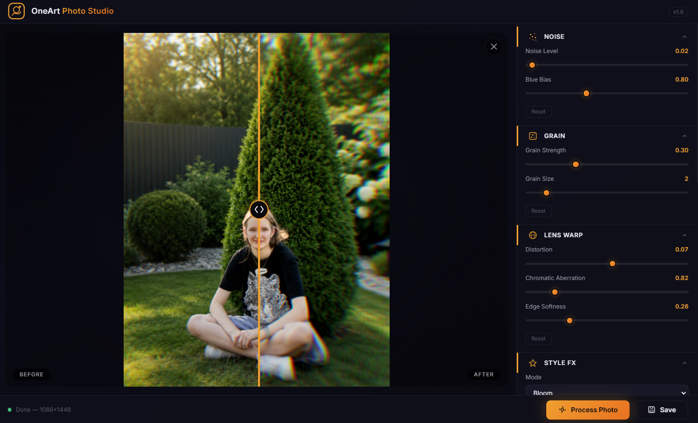

<div align="center">


# OneArt Photo Studio

### Make your phone photos look like they were shot on a cinema camera — **100% offline, on your device**

[](LICENSE)
[](https://www.python.org/)
[](https://github.com/oneartai-lab/OnePhoto/releases)
[](#android)
[](https://github.com/oneartai-lab/OnePhoto)

> **Your photos never leave your device.** No account. No subscription. No internet required.

<div align="center">

### [⬇️ Download for Windows — v1.0 (36 MB)](https://github.com/oneartai-lab/OnePhoto/releases/latest)
*No Python required · Just unzip and run*

</div>

---




</div>

---

## 🎯 What It Does

**OneArt Photo Studio** applies professional cinematic film effects to your photos and saves them with **realistic camera EXIF metadata** — so your photo looks like it came straight from a Canon R5, Sony A7 IV, or Leica M11.

```
Before: flat iPhone snap
After:  cinematic film photo with grain, bloom & Canon EOS R5 metadata
```

**Key insight:** Your audience doesn't see your camera. They see the final image — and the metadata in it.

---

## ✨ Core Features

### 🎞️ Cinematic Film Pipeline

| Effect | What it does |
|--------|-------------|
| **Film Grain** | Organic analog grain — like Kodak Portra or Ilford HP5 |
| **Halation** | Glowing warm highlights bleeding around bright areas — pure cinema |
| **Bloom** | Soft, ethereal glow on highlights |
| **Cinematic Grade** | Hollywood color — warm highlights, teal shadows |
| **Soft Portrait** | Skin-smoothing bokeh-like softness |
| **GlitchArt** | Digital distortion / lo-fi aesthetic |
| **Lens Warp** | Barrel distortion + chromatic aberration |
| **Vignette** | Radial darkening for focused composition |
| **Tone Adjust** | Brightness, contrast, highlights, shadows, warmth |

### 📷 Realistic Camera EXIF Metadata

> **This is the killer feature.** Export your photo with metadata from a real camera — the viewer's app shows "Canon EOS R5" in the EXIF panel.

| Preset | Camera | Lens |
|--------|--------|------|
| **Canon** | Canon EOS R5 | RF 24-70mm F2.8 L IS USM |
| **Sony** | Sony A7 IV | FE 24-70mm F2.8 GM |
| **Nikon** | Nikon Z9 | NIKKOR Z 24-70mm f/2.8 S |
| **Fujifilm** | Fujifilm X-T5 | XF 23mm F1.4 R LM WR |
| **Leica** | Leica M11 | SUMMICRON-M 35mm f/2 ASPH |
| **iPhone** | iPhone 15 Pro | Triple camera f/1.78 |

### 🔒 Privacy First
- ✅ **Zero data collection** — no telemetry, no analytics
- ✅ **Fully offline** — works without internet
- ✅ **Open source** — read every line of code
- ✅ **No account required**

---

## 🚀 Quick Start

### Windows Desktop — Simple (No Python needed)

1. Go to **[Releases](https://github.com/oneartai-lab/OnePhoto/releases/latest)**
2. Download `OneArtPhotoStudio-v1.0-windows-x64.zip`
3. Unzip anywhere → run `OneArtPhotoStudio.exe`

### Windows Desktop — From Source

```bash
# 1. Clone
git clone https://github.com/oneartai-lab/OnePhoto.git
cd OnePhoto

# 2. Install dependencies
pip install -r requirements.txt

# 3. Launch
python start_app.py
```

> **Or just double-click:** `OneArt Photo Studio.bat`

### Android

```bash
npm install
npx cap sync android
npx cap open android   # then Run in Android Studio
```

---

## 🏗️ How It Works

```
Your photo (JPG/PNG/RAW/HEIC)
        │
        ▼
┌─────────────────────────────────┐
│  OneArt Processing Pipeline     │
│                                 │
│  1. Noise (sensor simulation)   │
│  2. Grain (film emulation)      │
│  3. Lens Warp (optics sim)      │
│  4. Style FX (cinematic grade)  │
│  5. Vignette (composition)      │
│  6. Tone Adjust (color science) │
└─────────────────────────────────┘
        │
        ▼
JPEG output + Realistic EXIF
(Canon/Sony/Nikon/Fuji/Leica/iPhone)
```

> On **Android / browser**: all processing runs client-side in JavaScript — no server needed.

---

## 📦 Project Structure

```
OnePhoto/
├── start_app.py              # Desktop entry point (pywebview)
├── requirements.txt          # Python dependencies
│
├── engine/                   # 🔧 Image processing core
│   ├── nodes.py              # All effects (ComfyUI-compatible nodes)
│   ├── lens_distortion_safe.py
│   ├── presets.py            # Camera EXIF presets
│   └── luts/                 # Drop .cube LUT files here
│
├── frontend/                 # 🖥️ Web UI
│   ├── index.html
│   ├── style.css             # Dark premium UI
│   └── app.js                # JS bridge + client-side processing
│
└── android/                  # 📱 Capacitor Android project
```

---

## ⚙️ ComfyUI Node Pack

The `engine/` module works as a **ComfyUI custom node pack** — drop it into your `custom_nodes/` folder.

Nodes available under `oneart/photo`:

| Node | Description |
|------|-------------|
| `OneArtPhotoLoad` | Load image / RAW with EXIF |
| `OneArtPhotoNoise` | Sensor noise simulation |
| `OneArtPhotoGrain` | Analog film grain |
| `OneArtPhotoStyleFX` | Cinematic effects (Bloom, Halation, etc.) |
| `OneArtPhotoVignette` | Radial vignette |
| `OneArtPhotoToneAdjust` | Full tone grading |
| `OneArtPhotoLUT` | Apply .cube / image LUT |
| `OneArtPhotoMetadata` | Attach realistic EXIF |
| `OneArtPhotoSaveJpeg` | Save with EXIF passthrough |

---

## 📋 Requirements

| Package | Version | Purpose |
|---------|---------|---------|
| `pywebview` | ≥ 5.0 | Desktop WebView window |
| `Pillow` | latest | Image I/O and processing |
| `numpy` | latest | Fast array math |
| `piexif` | latest | EXIF metadata |
| `pillow-heif` | latest | HEIC/HEIF support |
| `rawpy` | latest | RAW camera files (DNG, CR2, NEF…) |
| `tifffile` | latest | TIFF support |

---

## 📄 License

**MIT** — free to use, modify, and distribute. See [LICENSE](LICENSE).

---

## 🤝 Contributing

PRs welcome! Areas we'd love help with:
- 🎨 More Style FX modes (Cross-process, Duotone, Cyanotype…)
- 📸 More camera presets (Hasselblad, Pentax, Olympus…)
- 🌍 More UI languages
- 📦 Windows installer / `.exe` build

---

<div align="center">

**[⬇️ Download](https://github.com/oneartai-lab/OnePhoto/releases) · [🐛 Report Bug](https://github.com/oneartai-lab/OnePhoto/issues) · [💡 Request Feature](https://github.com/oneartai-lab/OnePhoto/issues)**

Made with ❤️ by [OneArt AI Lab](https://github.com/oneartai-lab)

</div>
